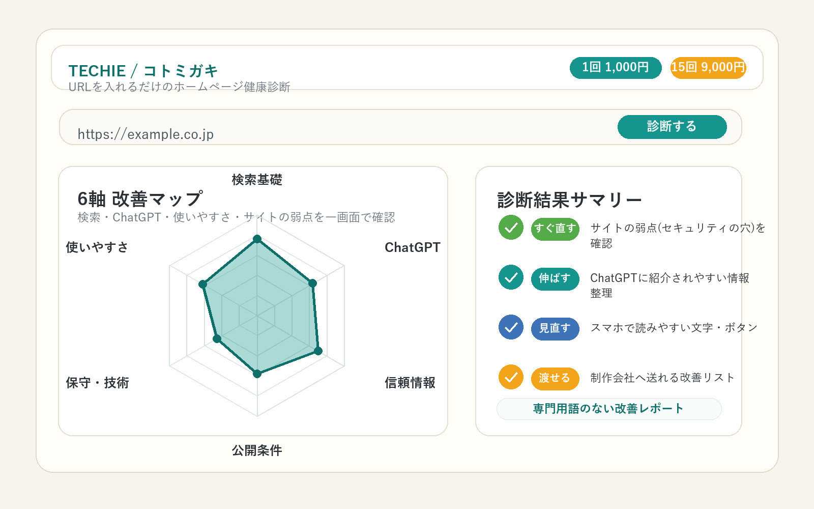

# プレスリリース案: コトミガキ提供開始

**2026年○月○日**  
**株式会社○○○○**

## ホームページ健康診断「コトミガキ」を1回1,000円で提供開始
### URL入力だけで、ChatGPTに紹介されやすいか・サイトの弱点(セキュリティの穴)・見づらさを改善レポート化

株式会社○○○○(本社:○○、代表:○○)は、日本語ホームページ専用の診断サービス「コトミガキ」を提供開始しました。URLを入力するだけで、検索で見つかりやすいか、ChatGPTに紹介されやすい情報整理になっているか、サイトの弱点(セキュリティの穴)やスマホでの使いづらさがないかを診断します。専門用語を抑えた改善レポートを出力し、料金は1回1,000円、15回分まとめると9,000円(1回あたり600円、いずれも税抜)です。

---

## こんな不安に応えます

- ホームページはあるのに、問い合わせや相談が増えない
- ChatGPTで調べる人が増えているのに、自社が紹介されやすい状態か分からない
- 何年も前に作ったままで、サイトの弱点(セキュリティの穴)を確認できていない
- スマホで文字が読みにくい、ボタンが押しづらいなど、訪問者が途中で離れているかもしれない

専門業者の調査は高額になりやすく、レポートも専門用語が多くなりがちです。コトミガキは、ホームページの状態を「何を直せばよいか」まで分かる形で可視化し、制作会社や社内担当者にそのまま渡せる改善リストとして整理します。

## コトミガキの3つの診断

### 1. 検索とChatGPTに見つけてもらいやすいか

ページの見出し、説明文、会社・商品情報、FAQの有無などを確認し、検索でもChatGPTでも内容が伝わりやすい構成になっているかを診断します。「結論が先にあるか」「会社やサービスの説明が不足していないか」「質問に答える情報があるか」を点数と改善案で示します。

### 2. サイトの弱点(セキュリティの穴)がないか

古い仕組みのまま公開されているページ、外から見える古い部品、公開設定の気になるサインなどを、外部から確認できる範囲で洗い出します。サイトに負荷をかける調査は行わず、確認が必要な項目を「制作会社へ渡せるリスト」として出力します。

### 3. 訪問者を逃す見づらさ・使いづらさを見つける

スマホで読みにくい文字、押しづらいボタン、画像説明の不足、ページ構造の分かりにくさなど、問い合わせや申込みの前に離脱しやすい原因を整理します。高齢のお客様が多い業種や、スマホ閲覧が多い店舗・サービスサイトでも使いやすい診断です。

## 料金

| プラン | 価格(税抜) | 1回あたり |
|---|---:|---:|
| 都度利用 | 1,000円/回 | 1,000円 |
| 15回分クレジット | 9,000円 | 600円 |

月1回の定期健診、リニューアル前後の確認、複数ページの見比べに使いやすい価格にしました。

## 診断後の改善まで支援

コトミガキは、TECHIEシリーズの中核となるホームページ診断サービスです。診断結果をもとに、関連サービスと組み合わせて「診断する、効果を見る、発信する」の流れを作れます。

- **コトミガキ**: ホームページを診断し、直すべき点を明らかにする
- **コトメガネ**: ChatGPT経由で実際にお客様が来ているかを見える化する
- **コトメイク**: 診断結果をもとに、記事やSNS投稿文を作る

作りっぱなしのホームページを、見つけてもらい、選ばれ、問い合わせにつながるホームページへ育てます。

## 提供開始日・お申し込み

- 提供開始日: 2026年○月○日
- お申し込み・詳細: ○○○○(URL)

## 添付画像案

- レーダーチャートUI画像: `kotomigaki_radar_ui.png`
- キービジュアル画像: `kotomigaki_key_visual.png`

## 会社概要・お問い合わせ

株式会社○○○○  
所在地: ○○  
代表: ○○  
担当: 横山  
E-mail: h.yokoyama@kyotokogyo.co.jp

