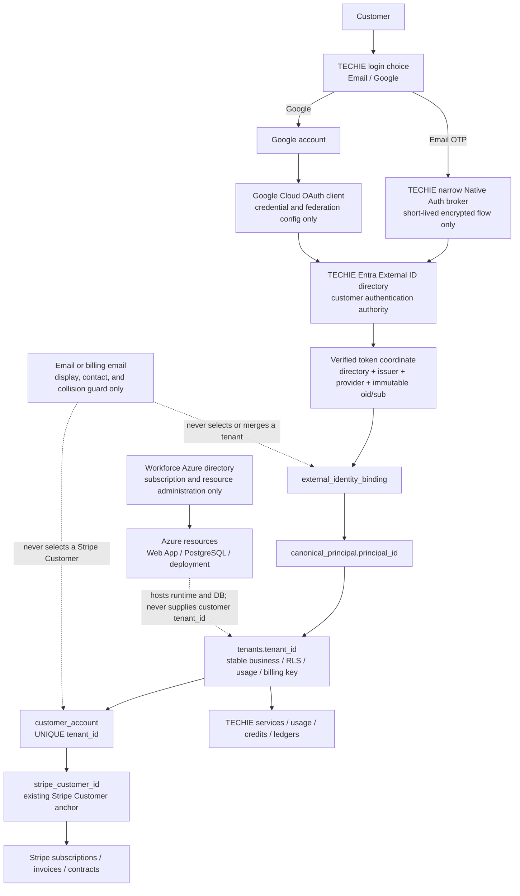

# TECHIE identity, business tenant, and Stripe architecture

- Updated: 2026-08-04 JST
- Current owner: one SOL agent only
- Status: `CANONICAL DESIGN + NATIVE EMAIL LOCAL CANDIDATE / LIVE AUTH NOT VALIDATED / NO LIVE WRITE`
- Applies to: Email OTP and Google customer sign-in through TECHIE Entra External ID

## Purpose

This document is the canonical boundary map for adding Google alongside Email
OTP without changing the existing Entra management model, business
tenant, or Stripe relationship.

The intended result is one TECHIE customer account with one stable business
`tenant_id`. That account may have multiple verified login methods. A login
provider identifies a person to Entra; it does not select a business tenant,
Stripe Customer, subscription, contract, credit balance, or ledger.

## Current, candidate, and target states

| State | What is known | What must not be inferred |
|---|---|---|
| Read-only production observation | The public Hub showed Email available, Google as test availability, and Microsoft unavailable. The Google action reached the Google account chooser without account selection. The production External ID flow visibly selected Email OTP and Google; Microsoft remained isolated to its Pilot flow. See `identity_provider_ui_readonly_revalidation_20260804.md`. | This does not prove a completed Google registration/login, Microsoft production availability, canonical binding, Stripe continuity, or deployment of the repository candidate. |
| Live backend evidence | The additive identity schema exists, production resolver behavior remains `legacy`, automatic provisioning is off, binding-claim trust is off, and the identity tables were empty at the last approved read-only check. The independent Azure/DB target preflight passed without an Azure write or DB connection. | The binding hardening migration is not applied. No existing customer is linked through the new canonical tables. |
| Repository candidate | The Hub source presents one grouped Email and Google chooser. Email uses a TECHIE-owned Native Authentication OTP screen only when backend and live-verification gates are both true. Google is independently gated; Microsoft SSO is absent. | Repository code and synthetic-browser evidence are not live Entra configuration or deployment proof. |
| Target | Email and Google are understandable choices; both terminate at TECHIE Entra External ID and resolve to the same canonical TECHIE principal when the customer has linked them. Microsoft-hosted addresses use Email OTP. | Provider addition does not authorize resolver cutover, customer bootstrap, Stripe changes, DB writes, API deployment, or production provider enablement. |

## Directory and identity boundary



The two Azure directories have different roles. The workforce directory owns
the Azure subscription and resources. The TECHIE External ID directory owns
customer authentication. A directory tenant ID is therefore never the
customer's business `tenant_id`.

## Identifier contract

| Identifier | Authority | Stability and allowed use | Prohibited use |
|---|---|---|---|
| Workforce Azure directory tenant | Azure administration | Select and verify the subscription/resource context. | Customer identity, business tenancy, or Stripe lookup. |
| External ID `directory_tenant_id` | TECHIE Entra External ID | Proves the token came from the one approved customer directory. | Business tenant key or customer-account key. |
| Token `issuer + oid/sub + provider` | Entra-verified token | Immutable external identity coordinate for one login method. | Email-based account merge, Stripe lookup, or cross-directory guessing. |
| `canonical_principal.principal_id` | TECHIE PostgreSQL | Stable application principal that may own several verified bindings. | Stripe Customer ID or directory tenant ID. |
| `tenants.tenant_id` | TECHIE PostgreSQL | Stable business, RLS, service-access, usage, and billing key. It must remain unchanged when a login method is added or removed. | A value selected from email equality or Stripe metadata. |
| `customer_account.customer_account_id` | TECHIE PostgreSQL | Internal billing-account row. | Authentication subject. |
| `customer_account.stripe_customer_id` | TECHIE PostgreSQL reference to Stripe | Current inspected application anchor from one business tenant to the existing Stripe Customer. | Identity-provider coordinate or automatic account-merge key. |
| Email / billing email | Entra, user, and billing contact | User communication, display, and collision detection. | Proof of ownership, tenant selection, or automatic principal merge. |

`tenants.stripe_id` still exists in the initialization schema, but the current
inspected billing and usage paths resolve through
`customer_account.tenant_id -> customer_account.stripe_customer_id`. No
current application lookup of `tenants.stripe_id` was found in this review.
Until a separate schema-compatibility audit decides its disposition, it must
not be used by the identity resolver or treated as the canonical Stripe
anchor.

## Existing customer: add Email or Google safely

1. Resolve the customer through an already approved immutable binding, or
   complete a separately approved existing-customer bootstrap from verified
   External ID coordinates.
2. Reauthenticate the already bound source login method.
3. Authenticate the new Email or Google method in the same TECHIE
   External ID directory.
4. Verify the exact directory, issuer, provider, immutable subject, audience,
   recent authentication, one-time intent, and cross-principal uniqueness.
5. Add only an `external_identity_binding` and identity audit data to the same
   `canonical_principal`.
6. Re-read and prove that `tenants.tenant_id`, `customer_account`,
   `stripe_customer_id`, subscriptions, contracts, credits, and ledgers are
   unchanged.

If the email strings happen to match, the procedure is still required. Email
equality may stop an unsafe operation; it may never approve or select one.

## Provider-specific Hub gate

The Hub may present a provider as selectable only when its route is explicit
and independently reversible:

- Email OTP is a deliberate Email choice. It is enabled only when
  `EMAIL_NATIVE_AUTH_ENABLED=true` and
  `EMAIL_NATIVE_AUTH_LIVE_VERIFIED=true`. The next TECHIE screen contains one
  email field and no provider chooser. The delegated combined Entra screen is
  a separate operator fallback, disabled by default and never automatic.
- Google requires both `GOOGLE_AUTH_ENABLED=true` and an independently proven
  `GOOGLE_AUTH_DIRECT_ROUTE_VERIFIED=true`; missing or false configuration
  fails closed. The route may use `domain_hint=google` only after the exact
  production app/user-flow association reaches Google without `AADSTS90023`.
  A post-Native-enablement recheck against Entra's canonical run-user-flow
  endpoint still returned `AADSTS90023`, so the verification flag remains
  false.
- Microsoft SSO has no public entry point or runtime configuration. Outlook,
  Hotmail, Microsoft 365, and other Microsoft-hosted addresses use Email OTP.
  The isolated Microsoft Pilot is historical evidence only; see
  `microsoft_external_id_routing_decision_20260804.md`. The link-intent API and
  repository also accept only Email and Google; dormant historical Microsoft
  coordinates remain readable but cannot be used to create or complete a new
  Microsoft account link.
- Google uses the same verified-provider gate for login, signup, and its
  account-link entry point. Native Email now has a local source/target link
  candidate: it reauthenticates the bound source, creates a one-time server
  intent, then authenticates or explicitly signs up the target Email identity.
  Email equality is never used. Both public and backend identity-link flags
  remain off. Existing-target and explicit target-signup browser paths pass
  with a synthetic local broker. A synthetic conflict also clears link state
  and the target session, blocks cached-account fallback, removes the stale
  logout control, and requires a fresh login. Live OTP, live DB transaction,
  real External ID user reconciliation, and invariant proof are
  `NOT_VALIDATED`.

A target Native Email signup can create an External ID user before the binding
completion succeeds. A conflict therefore can leave an unbound External ID
user that requires an approved operator reconciliation/removal procedure. It
cannot create a business tenant or Stripe relationship because automatic
provisioning remains off and the target token is used only for the guarded
link-complete request. This residual remains a live-link `HOLD`.

The settings are UI/routing gates only. They do not authorize or replace the
Entra provider/user-flow/app association gate, identity schema hardening,
existing-customer bootstrap, resolver cutover, or Stripe invariant checks.

The local deployment candidate keeps identity linking undeployable by default.
Enabling it requires resolver `enforce`, schema verification, separate binding-
hardening and existing-customer-bootstrap confirmations, distinct protected
receipt SHA-256 values, with auto-provision and binding-claim trust still off.
The PowerShell entrypoint fails before Azure CLI when any condition is missing;
Bicep independently reduces the effective value to false. A confirmation
switch or syntactically valid hash is not live evidence and must never be set
without its separately approved immutable receipt.

## New customer boundary

Automatic provisioning remains off. A new customer flow needs its own design
and explicit approval. The target model must allocate a business `tenant_id`
once, independently from the provider-specific `oid` or `sub`, then create the
canonical principal and the first binding. Stripe Customer creation or reuse
must occur only through the business tenant and `customer_account`, never
through the provider coordinate.

The current guarded resolver contains legacy-compatibility behavior in which a
verified Entra object ID may match or seed a tenant UUID. That behavior is not
the general three-provider tenant model and must not be extended to Google or
federated customer linking. Existing-customer bootstrap and a future
new-customer allocation policy remain separate gates.

## Stripe invariants and current code risk

Provider enablement and account linking must not change the Stripe integration.
The invariant is:

```text
verified login coordinate
  -> canonical principal
  -> stable business tenant_id
  -> one customer_account
  -> existing stripe_customer_id
  -> existing subscription / contract / ledger history
```

Source inspection on 2026-08-04 found an existing, provider-independent risk
in `shared/billing/repository.py`: when an `invoice.paid` event refers to an
unknown Stripe Customer and the invoice-line metadata does not contain a
`tenant_id`, `record_billing_from_invoice` can mint a random tenant UUID and
create a customer account. This docs-only slice does not change that code or
Stripe behavior.

Before any Google production cutover, a separately approved
billing/API change must make that path fail closed or quarantine the event for
operator reconciliation. An unknown Stripe Customer must never create or
select a business tenant by fallback, email, or unverified metadata. Until
that separate change is reviewed and regression-tested, this item remains a
production-cutover `HOLD`.

## Approval matrix

| Operation | Current state |
|---|---|
| Documentation, local source inspection, and local tests | Allowed in this slice. |
| Read-only target preflight already completed | Evidence only; do not rerun unless its assumptions drift. |
| Entra provider/user-flow write | Not authorized. |
| Google Cloud OAuth write | Not authorized. |
| Binding-hardening DB dry-run or apply | Not authorized; separate approval required for each. |
| Existing-customer manifest creation, dry-run, or apply | Not authorized; protected-session and separate approvals required. |
| Resolver `shadow`/`enforce`, automatic provisioning, or binding-claim trust | Not authorized. |
| Stripe, billing API, webhook, or metadata behavior change | Not authorized. |
| Production deployment, PR merge, or upstream push | Not authorized. |

## Mandatory stop conditions

Stop before any write when the Azure directory role is ambiguous, the External
ID issuer/provider is not exact, a tenant would be selected from email or
Stripe metadata, an existing business/Stripe identifier would change, a
binding is ambiguous or duplicated, live provider state has not been
revalidated, a secret or customer value could be exposed, or the required
separate approval and rollback evidence do not exist.
