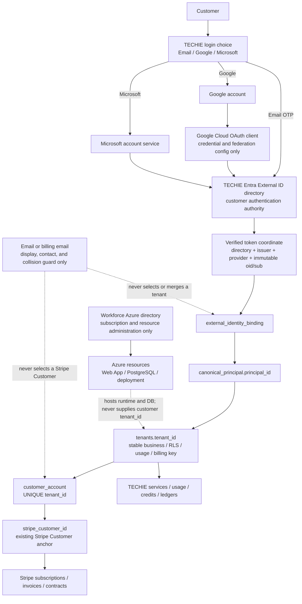

# TECHIE identity, business tenant, and Stripe architecture

- Updated: 2026-08-04 JST
- Current owner: one SOL agent only
- Status: `DOCS-ONLY CANONICAL DESIGN / LIVE PROVIDER+UI STATE NOT REVALIDATED / NO LIVE WRITE AUTHORIZED`
- Applies to: Email, Google, and Microsoft customer sign-in through TECHIE Entra External ID

## Purpose

This document is the canonical boundary map for adding Google and Microsoft
login methods without changing the existing Entra management model, business
tenant, or Stripe relationship.

The intended result is one TECHIE customer account with one stable business
`tenant_id`. That account may have multiple verified login methods. A login
provider identifies a person to Entra; it does not select a business tenant,
Stripe Customer, subscription, contract, credit balance, or ledger.

## Current, candidate, and target states

| State | What is known | What must not be inferred |
|---|---|---|
| User-observed production | Email is the currently usable customer login method. | Google or Microsoft production availability has not been established by this docs-only pass. |
| Live backend evidence | The additive identity schema exists, production resolver behavior remains `legacy`, automatic provisioning is off, binding-claim trust is off, and the identity tables were empty at the last approved read-only check. The independent Azure/DB target preflight passed without an Azure write or DB connection. | The binding hardening migration is not applied. No existing customer is linked through the new canonical tables. |
| Repository candidate | The Hub source presents Email, Google, and Microsoft login cards plus a two-authentication account-link flow. Google alone has a provider hint; Microsoft has no `domain_hint=login.live.com`. | Repository code, tests, commit, push, or a draft PR is not deployment or live UI evidence. |
| Target | Email, Google, and Microsoft are equally understandable choices; all terminate at TECHIE Entra External ID and resolve to the same canonical TECHIE principal when the customer has linked them. | Provider addition does not authorize resolver cutover, customer bootstrap, Stripe changes, DB writes, API deployment, or production provider enablement. |

## Directory and identity boundary



The two Azure directories have different roles. The workforce directory owns
the Azure subscription and resources. The TECHIE External ID directory owns
customer authentication. A directory tenant ID is therefore never the
customer's business `tenant_id`.

## Identifier contract

| Identifier | Authority | Stability and allowed use | Prohibited use |
|---|---|---|---|
| Workforce Azure directory tenant | Azure administration | Select and verify the subscription/resource context. | Customer identity, business tenancy, or Stripe lookup. |
| External ID `directory_tenant_id` | TECHIE Entra External ID | Proves the token came from the one approved customer directory. | Business tenant key or customer-account key. |
| Token `issuer + oid/sub + provider` | Entra-verified token | Immutable external identity coordinate for one login method. | Email-based account merge, Stripe lookup, or cross-directory guessing. |
| `canonical_principal.principal_id` | TECHIE PostgreSQL | Stable application principal that may own several verified bindings. | Stripe Customer ID or directory tenant ID. |
| `tenants.tenant_id` | TECHIE PostgreSQL | Stable business, RLS, service-access, usage, and billing key. It must remain unchanged when a login method is added or removed. | A value selected from email equality or Stripe metadata. |
| `customer_account.customer_account_id` | TECHIE PostgreSQL | Internal billing-account row. | Authentication subject. |
| `customer_account.stripe_customer_id` | TECHIE PostgreSQL reference to Stripe | Current inspected application anchor from one business tenant to the existing Stripe Customer. | Identity-provider coordinate or automatic account-merge key. |
| Email / billing email | Entra, user, and billing contact | User communication, display, and collision detection. | Proof of ownership, tenant selection, or automatic principal merge. |

`tenants.stripe_id` still exists in the initialization schema, but the current
inspected billing and usage paths resolve through
`customer_account.tenant_id -> customer_account.stripe_customer_id`. No
current application lookup of `tenants.stripe_id` was found in this review.
Until a separate schema-compatibility audit decides its disposition, it must
not be used by the identity resolver or treated as the canonical Stripe
anchor.

## Existing customer: add Google or Microsoft safely

1. Resolve the customer through an already approved immutable binding, or
   complete a separately approved existing-customer bootstrap from verified
   External ID coordinates.
2. Reauthenticate the already bound source login method.
3. Authenticate the new Email, Google, or Microsoft method in the same TECHIE
   External ID directory.
4. Verify the exact directory, issuer, provider, immutable subject, audience,
   recent authentication, one-time intent, and cross-principal uniqueness.
5. Add only an `external_identity_binding` and identity audit data to the same
   `canonical_principal`.
6. Re-read and prove that `tenants.tenant_id`, `customer_account`,
   `stripe_customer_id`, subscriptions, contracts, credits, and ledgers are
   unchanged.

If the email strings happen to match, the procedure is still required. Email
equality may stop an unsafe operation; it may never approve or select one.

## New customer boundary

Automatic provisioning remains off. A new customer flow needs its own design
and explicit approval. The target model must allocate a business `tenant_id`
once, independently from the provider-specific `oid` or `sub`, then create the
canonical principal and the first binding. Stripe Customer creation or reuse
must occur only through the business tenant and `customer_account`, never
through the provider coordinate.

The current guarded resolver contains legacy-compatibility behavior in which a
verified Entra object ID may match or seed a tenant UUID. That behavior is not
the general three-provider tenant model and must not be extended to Google or
Microsoft customer linking. Existing-customer bootstrap and a future
new-customer allocation policy remain separate gates.

## Stripe invariants and current code risk

Provider enablement and account linking must not change the Stripe integration.
The invariant is:

```text
verified login coordinate
  -> canonical principal
  -> stable business tenant_id
  -> one customer_account
  -> existing stripe_customer_id
  -> existing subscription / contract / ledger history
```

Source inspection on 2026-08-04 found an existing, provider-independent risk
in `shared/billing/repository.py`: when an `invoice.paid` event refers to an
unknown Stripe Customer and the invoice-line metadata does not contain a
`tenant_id`, `record_billing_from_invoice` can mint a random tenant UUID and
create a customer account. This docs-only slice does not change that code or
Stripe behavior.

Before any Google/Microsoft production cutover, a separately approved
billing/API change must make that path fail closed or quarantine the event for
operator reconciliation. An unknown Stripe Customer must never create or
select a business tenant by fallback, email, or unverified metadata. Until
that separate change is reviewed and regression-tested, this item remains a
production-cutover `HOLD`.

## Approval matrix

| Operation | Current state |
|---|---|
| Documentation, local source inspection, and local tests | Allowed in this slice. |
| Read-only target preflight already completed | Evidence only; do not rerun unless its assumptions drift. |
| Entra provider/user-flow write | Not authorized. |
| Google Cloud OAuth write | Not authorized. |
| Binding-hardening DB dry-run or apply | Not authorized; separate approval required for each. |
| Existing-customer manifest creation, dry-run, or apply | Not authorized; protected-session and separate approvals required. |
| Resolver `shadow`/`enforce`, automatic provisioning, or binding-claim trust | Not authorized. |
| Stripe, billing API, webhook, or metadata behavior change | Not authorized. |
| Production deployment, PR merge, or upstream push | Not authorized. |

## Mandatory stop conditions

Stop before any write when the Azure directory role is ambiguous, the External
ID issuer/provider is not exact, a tenant would be selected from email or
Stripe metadata, an existing business/Stripe identifier would change, a
binding is ambiguous or duplicated, live provider state has not been
revalidated, a secret or customer value could be exposed, or the required
separate approval and rollback evidence do not exist.
