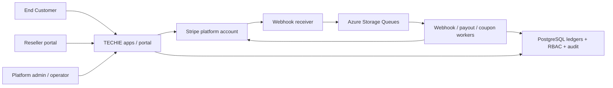
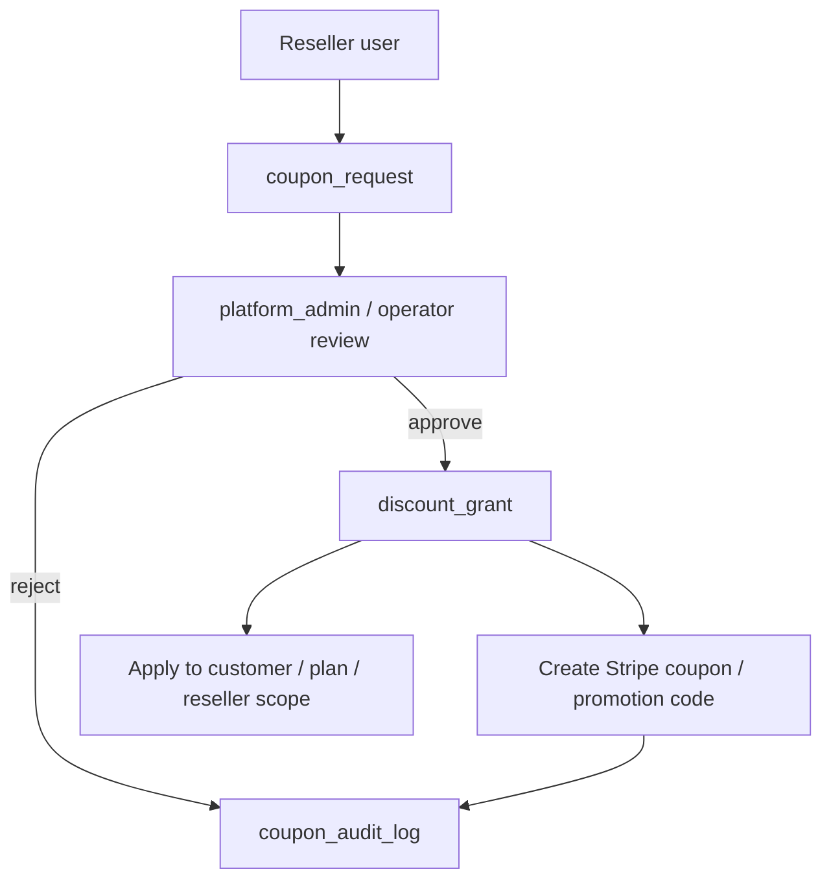

# Phase 2 Stripe / Reseller 実装概要

本資料は、Phase 2 で合意・実装した Stripe / reseller / contract / payout / coupon 管理の設計概要です。

## Scope

Phase 2 の基本方針は以下です。

- Stripe は billing、checkout、invoice、coupon、transfer、payout の system of record とします。
- Azure / PostgreSQL は reseller assignment、contract state、coupon approval、payout eligibility、RBAC、audit history の system of record とします。
- Identity は Microsoft Entra External ID を前提とします。
- 既存互換のため `AZURE_B2C_*` 系の環境変数名も一部残しています。
- Azure runtime 名は既存 production に合わせます。
  - PostgreSQL server: `techie-pg-server`
  - Container Apps: `kotomake`, `kotomigaki`, `kotomusubi`, `techie-hub`

## Phase 2 の前提

1. Connect account type は `Express` を想定します。
2. `invoice.paid` 後に payout ledger を作成します。
3. 実際の transfer は funds available / hold / refund 状態確認後の job として扱います。
4. coupon approval は platform user による single-step approval を想定します。
5. operator は policy 上許可された coupon request のみ処理できます。
6. reseller API / portal query は必ず `customer_reseller_assignment` で tenant/reseller scope を絞ります。
7. payout retry は最大 5 回までとし、それ以上は manual intervention とします。

## Responsibility split

| 領域 | Stripe | Azure / App / PostgreSQL |
|---|---|---|
| Product / price catalog | 正本 | 参照・cache のみ |
| Customer / checkout / subscription / invoice | 正本 | contract mirror と access control |
| Coupon / promotion code | 最終 object 作成 | approval workflow と audit |
| Connect account / transfer object | 正本 | reseller mapping、payout 判定、retry state |
| Webhook event | event source | verification、idempotency、queue、audit |
| Reseller assignment | metadata のみ | 正本 |
| Payout rule / eligibility | 非 authoritative | 正本 |
| Refund / chargeback | input event | adjustment ledger / clawback logic |

## Architecture

## 主要 DB 領域

- tenant / customer account
- principal role assignment
- reseller master
- customer reseller assignment
- subscription contract
- billing event ledger
- payment receipt ledger
- reseller payout rule
- reseller payout ledger
- reseller payout execution
- refund adjustment ledger
- coupon request / approval
- discount grant
- coupon audit log
- webhook event log

## Permission matrix

| 権限 | platform_admin | platform_operator | reseller |
|---|---|---|---|
| 全 customer / reseller / billing 閲覧 | Yes | Yes | No |
| 担当 reseller の customer 閲覧 | Yes | Yes | Yes |
| plan catalog / payout rule 編集 | Yes | No | No |
| reseller / connect account mapping 登録 | Yes | No | No |
| coupon request review | Yes | policy-limited | request only |
| coupon / promotion code 発行 | Yes | policy-limited | No |
| payout transfer 実行・retry | Yes | No | No |
| 担当 reseller の payout result 閲覧 | Yes | Yes | Yes |
| audit log 閲覧 | Yes | read-only subset | No |

## Webhook event 方針

| Event | Queue | DB effect |
|---|---|---|
| `checkout.session.completed` | `stripe-webhook-events` | session / contract linkage upsert |
| `customer.subscription.created` | `stripe-webhook-events` | `subscription_contract` create/update |
| `customer.subscription.updated` | `stripe-webhook-events` | contract status/date update |
| `customer.subscription.deleted` | `stripe-webhook-events` | contract canceled/ended |
| `invoice.paid` | `stripe-webhook-events` | billing event、receipt、payout ledger 作成 |
| `invoice.payment_failed` | `stripe-webhook-events` | billing failure 記録 |
| `payment_intent.succeeded` | `stripe-webhook-events` | receipt timing / settlement 補完 |
| `transfer.created` / `transfer.updated` | payout/webhook queue | payout execution 更新 |
| `charge.refunded` / dispute events | `stripe-webhook-events` | refund adjustment / payout hold |

## Payout calculation rule

1. Stripe の `invoice.paid` を billing recognition の起点とします。
2. 実際の receipt settlement は `payment_receipt_ledger` で別管理します。
3. payout eligibility は以下を満たす必要があります。
   - receipt status が settled
   - funds available
   - unresolved refund / chargeback / hold がない
   - reseller と plan に対する active payout rule がある
4. payout basis は discount 後の net bill amount を基準とします。
5. execution は最大 5 回 retry し、それ以上は manual review とします。

## Coupon workflow

## 実装・テスト checklist

- Stripe webhook signature を検証すること。
- duplicate event id を idempotent に無視すること。
- `invoice.paid` が webhook retry されても ledger が二重作成されないこと。
- reseller user が他 reseller の customer を閲覧できないこと。
- refund / chargeback が adjustment record を作成し、payout を block/reverse できること。
- coupon approval が DB audit と Stripe object の両方に反映されること。
- operator が payout rule や Connect settings を変更できないこと。
- transfer retry が設定最大回数で止まり、manual follow-up になること。

## Operations runbook

- webhook processing が失敗する場合は `webhook_event_log`、queue、dead-letter queue を確認します。
- payout execution が失敗する場合は `reseller_payout_execution`、Stripe balance、hold/refund 状態を確認します。
- coupon issuance が approval 後に失敗した場合は DB approval record を保持し、Stripe error を `coupon_audit_log` に記録し、request id を idempotency key として再実行します。
