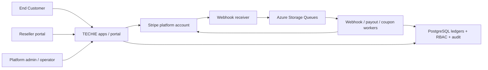
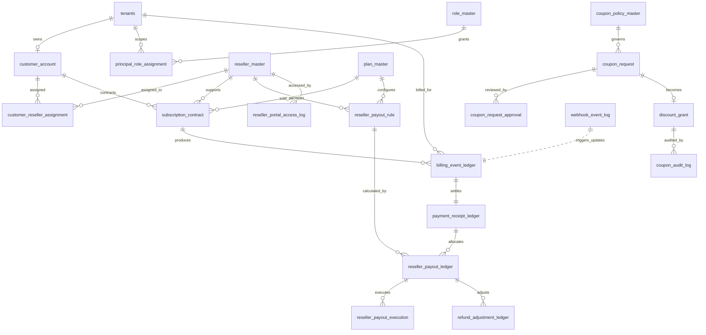
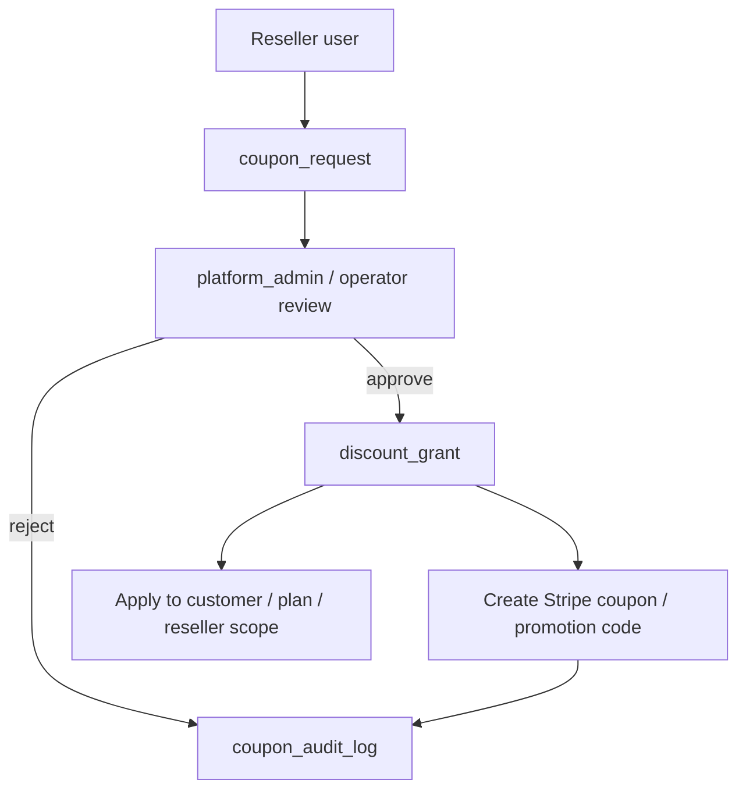

# Phase 2 Stripe / Reseller Implementation Blueprint

## Scope

This repository now contains the Phase 2 foundation for the client's revised model:

- Stripe remains the system of record for billing, checkout, invoices, coupons, transfers, and payouts.
- Azure and PostgreSQL remain the system of record for reseller assignment, contract state, coupon approval, payout eligibility, RBAC, and audit history.
- Identity should now be treated as Microsoft Entra External ID for new customer-facing setup. Legacy `AZURE_B2C_*` environment names are still emitted for backward compatibility with existing code paths.
- The Azure deployment keeps the existing runtime names already used by the project:
  - PostgreSQL server: `techie-pg-server`
  - Container Apps: `kotomake`, `kotomigaki`, `kotomusubi`, `techie-hub`

The implementation in this repo focuses on deployable infrastructure and database foundations. Application handlers for Stripe APIs, webhook processors, payout workers, and reseller/admin UI still need to be wired in the services themselves.

## Assumptions Chosen For Phase 2

These were not fully specified in the client note, so the repo is aligned to the safest interpretation:

1. Connect account type: `Express`
2. Payout accounting: create payout ledger records after `invoice.paid`
3. Transfer execution: separate job after funds are available and no hold/refund issue exists
4. Coupon approval: single-step approval flow owned by platform users
5. Operator permissions: operators may process coupon requests only where application policy allows it; they cannot change payout rules or Connect settings
6. Tenant separation: reseller APIs and portal queries must always filter through `customer_reseller_assignment`
7. Retry policy: up to 5 payout execution attempts before manual intervention

## Responsibility Split

| Area | Stripe | Azure / App / PostgreSQL |
|------|--------|---------------------------|
| Product and price catalog | Source of truth | Cached references only |
| Customer, checkout, subscription, invoice | Source of truth | Contract mirror and access control |
| Coupon / promotion code issuance | Final object created here | Approval workflow and audit source of truth |
| Connect account and transfer objects | Source of truth | Reseller mapping, payout decisioning, retry state |
| Webhook events | Event source | Verification, idempotency, queueing, processing audit |
| Reseller assignment and visibility | Metadata only if needed | Source of truth |
| Payout rule and eligibility | Not authoritative | Source of truth |
| Refund / chargeback adjustments | Input event source | Adjustment ledger and reseller clawback logic |

## Architecture

## Database ERD

## Permission Matrix

| Capability | platform_admin | platform_operator | reseller |
|-----------|----------------|-------------------|----------|
| View all customers / resellers / billing | Yes | Yes | No |
| View only assigned reseller customers | Yes | Yes | Yes |
| Edit plan catalog / payout rule | Yes | No | No |
| Register reseller / connect account mapping | Yes | No | No |
| Review coupon request | Yes | Yes, policy-limited | Request only |
| Issue coupon / promotion code | Yes | Yes, policy-limited | No |
| Execute or retry payout transfer | Yes | No | No |
| View payout result for assigned reseller | Yes | Yes | Yes |
| View audit logs | Yes | Yes, read-only subset | No |

## Webhook Event Matrix

| Event | Queue | DB effect | Notes |
|------|-------|-----------|-------|
| `checkout.session.completed` | `stripe-webhook-events` | upsert contract/session linkage | do not activate payout |
| `customer.subscription.created` | `stripe-webhook-events` | create or update `subscription_contract` | idempotent on Stripe subscription id |
| `customer.subscription.updated` | `stripe-webhook-events` | contract status and date updates | keep history in audit logs if needed |
| `customer.subscription.deleted` | `stripe-webhook-events` | mark contract canceled / ended | do not delete |
| `invoice.paid` | `stripe-webhook-events` | create `billing_event_ledger`, `payment_receipt_ledger`, `reseller_payout_ledger` | payout remains held until eligible |
| `invoice.payment_failed` | `stripe-webhook-events` | mark billing failure, optionally create adjustment | no payout eligibility |
| `payment_intent.succeeded` | `stripe-webhook-events` | enrich receipt timing / settlement state | useful for async methods |
| `transfer.created` / `transfer.updated` | `reseller-payout-jobs` or webhook queue | update `reseller_payout_execution` | tie back by transfer id |
| `payout.created` / `payout.updated` | `reseller-payout-jobs` or webhook queue | update transfer settlement visibility | reseller-facing reporting |
| `charge.refunded`, dispute events | `stripe-webhook-events` | create `refund_adjustment_ledger` and hold or reverse reseller payout | required from day one |

## Payout Calculation Rule

1. Billing is recognized when Stripe reports a successful invoice payment.
2. Receipt settlement is tracked separately from invoice success in `payment_receipt_ledger`.
3. Payout eligibility requires:
   - receipt status settled
   - funds available for payout
   - no unresolved refund / chargeback / hold
   - active payout rule for the reseller and plan
4. Payout basis is calculated from net bill amount after discounts and before or after fees depending on business policy. The schema supports both with explicit columns.
5. Execution is retried up to 5 times and then moved to manual review.

## Coupon Workflow

## API Surface To Implement In App Code

- `POST /api/billing/checkout-session`
- `POST /api/billing/customer-portal`
- `POST /api/stripe/webhooks`
- `POST /api/resellers`
- `POST /api/resellers/{id}/connect-onboarding`
- `GET /api/reseller-portal/customers`
- `GET /api/reseller-portal/customers/{id}`
- `GET /api/reseller-portal/payouts`
- `POST /api/reseller-portal/coupon-requests`
- `GET /api/admin/coupon-requests`
- `POST /api/admin/coupon-requests/{id}/approve`
- `POST /api/admin/coupon-requests/{id}/reject`
- `GET /api/admin/payouts`
- `POST /api/admin/payouts/{id}/execute`
- `POST /api/admin/payouts/{id}/retry`

## Test Checklist

- Stripe webhook signatures are verified and duplicate event ids are ignored.
- `invoice.paid` creates ledgers only once even with webhook retries.
- Reseller users cannot query another reseller's customers by API or UI.
- Refund or chargeback creates adjustment records and blocks or reverses payout.
- Coupon approval creates both DB audit state and Stripe objects.
- Operator cannot change payout rules or Connect settings.
- Transfer retries stop at the configured maximum and require manual follow-up.

## Operations Runbook

- If webhook processing fails repeatedly, inspect `webhook_event_log`, move the payload to dead letter, fix the handler, then replay.
- If payout execution fails, inspect `reseller_payout_execution`, confirm balance / hold state, then retry or mark manual review.
- If coupon issuance fails after approval, retain the approved DB record, log the Stripe error in `coupon_audit_log`, and reissue safely using the request id as the idempotency key.
