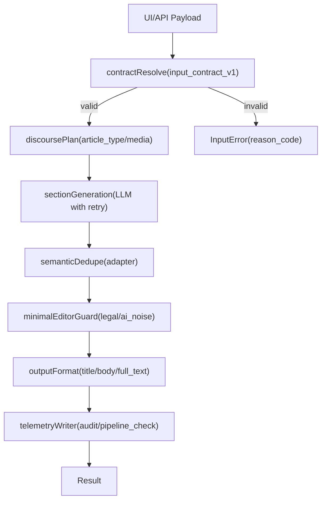

# Phase03 Minimal Pipeline Flow

## Flow Diagram

## Notes
- `daily_story` + `media=seo` は contract resolve で `style_compact_for_seo=true` を自動付与。
- LLM失敗時は retry 後に fallback paragraph を使い、fail-open で出力を継続。
- telemetry は `pipeline_check` と JSONL audit の双方へ記録（保存失敗は fail-open）。

