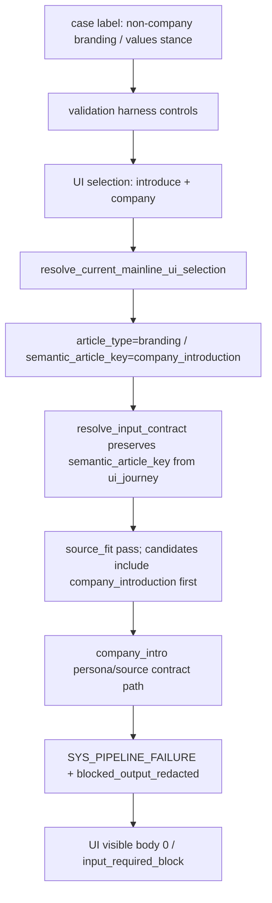

# current_mainline_branding_route_mismatch_diagnosis_2026-04-26 PROGRESS

## Status

Completed on 2026-04-26 JST.

## Package State

- Package status: completed
- Product code change: no
- Prompt / threshold / repair / guard / UI implementation change: no
- Announcement fix reopened: no
- Runtime owner assigned: no
- Next implementation owner, if needed: validation harness only

## Diagnosis Summary

`bl-branding-values-stance` reproduced the 2/2 body 0 shape because the replay path selected the company-introduction UI route while the case label expected generic non-company branding.

The route mismatch occurs before generation:

- target label: `non-company branding / values stance`
- expected key: `branding`
- selected UI controls: `会社・サービスの紹介記事を書く` -> `自社・会社紹介`
- resulting `ui_journey`: `{purpose_key:introduce,target_key:company}`
- resolved route: `article_type=branding`, `semantic_article_key=company_introduction`
- field source: `input_contract.field_sources.semantic_article_key=ui_journey`

Because `source_fit.status=pass` and `source_grounding_status=resolved`, the failure should not be recorded as source shortage or generic quality failure.

## Artifact Evidence

Artifact root:

- `C:\tetie\notecode\logs\current_mainline_log_source_ui_regression_20260426-023257\`

Observed values:

| Artifact | Field | Value |
|---|---|---|
| `source_inventory.json` | `article_type_target` | `non-company branding / values stance` |
| `source_inventory.json` | `article_type_for_ui` | `non-company branding` |
| `source_inventory.json` | `semantic_article_key_expected` | `branding` |
| `source_inventory.json` | `controls.purpose` | `会社・サービスの紹介記事を書く` |
| `source_inventory.json` | `controls.target` | `自社・会社紹介` |
| `per_attempt_summary.jsonl` | attempt 1 outcome | `input_required_block`, body 0 |
| `per_attempt_summary.jsonl` | attempt 2 outcome | `input_required_block`, body 0 |
| `per_attempt_summary.jsonl` | actual route | `article_type=branding`, `semantic_article_key=company_introduction` |
| `latest_generation_output.json` | `ui_journey` | `{purpose_key:introduce,target_key:company}` |
| `latest_generation_output.json` | `input_contract.field_sources.semantic_article_key` | `ui_journey` |
| `latest_generation_output.json` | `input_contract.source_fit.status` | `pass` |
| `latest_generation_output.json` | `input_contract.source_grounding_status` | `resolved` |
| `latest_generation_output.json` | `input_contract.source_fit.candidate_targets` | `company_introduction`, `implementation_case`, `improvement_case` |

## Route Flow

## Classification

- Primary: `validation harness selected wrong UI path`.
- Secondary / downstream: runtime route mismatch into `branding/company_introduction`.
- Body 0 explanation: company-introduction route failure/redaction path after wrong route selection.

Not primary:

- source shortage
- announcement route or announcement fix
- prompt problem
- threshold problem
- repair problem
- `pipeline.py` article-type branching gap
- product UI route-map defect
- input contract resolver over-preference

## Next Owner

If implementation is needed, assign only the validation harness owner.

Expected next hypothesis:

- The regression validation case is named and expected as non-company branding, but the harness replays it through the company-introduction UI path. The harness should either select a route that matches the expected generic branding key, or relabel/exclude the case so the expected key and selected UI route agree.

Do not assign product code owners for this package.

## Verification

- Five package docs created.
- WORKLOG update required for closeout.
- No product code changes.
- No pytest required because this is docs-only.
