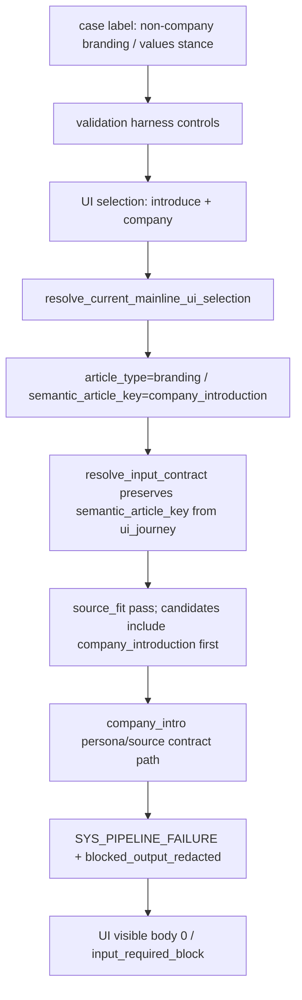

# current_mainline_branding_route_mismatch_diagnosis_2026-04-26 README

## Objective

- `current_mainline_log_source_ui_regression_2026-04-26` で残った `non-company branding / values stance` の route mismatch を docs-only で診断する。
- `bl-branding-values-stance` が body 0 / `input_required_block` になった原因を、source不足や品質問題ではなく route 解決の問題として分離する。
- announcement fix は close 済みとして扱い、再オープンしない。
- 次に実装が必要な場合も owner を validation harness 1つに限定する。

## Hard Constraints

- Product code変更禁止。
- Prompt変更禁止。
- Threshold変更禁止。
- Repair変更禁止。
- `pipeline.py` に新しい article-type別分岐を足さない。
- announcement fix を触らない。
- `1 issue = 1 owner scope` を維持する。
- この package は docs-only で停止する。

## Source Of Truth

- Current regression package:
  - `C:\tetie\notecode\plan\current_mainline_log_source_ui_regression_2026-04-26\PROGRESS.md`
- Artifact root:
  - `C:\tetie\notecode\logs\current_mainline_log_source_ui_regression_20260426-023257\`
- Relevant artifact files:
  - `source_inventory.json`
  - `per_attempt_summary.jsonl`
  - `ui_live\bl-branding-values-stance\attempt_1\latest_generation_output.json`
  - `ui_live\bl-branding-values-stance\attempt_2\latest_generation_output.json`
  - `run_log_source_ui_regression.py`
- Route mapping source of truth:
  - `C:\tetie\notecode\note\current_mainline_runner.py`

## Evidence

| Checkpoint | Observed Value | Judgment |
|---|---|---|
| case label | `non-company branding / values stance` | target says non-company branding |
| expected semantic key | `branding` | generic branding expected by validation label |
| UI controls | `purpose=会社・サービスの紹介記事を書く`, `target=自社・会社紹介` | UI path is company introduction |
| ui_journey | `{purpose_key:introduce,target_key:company}` | routes to company |
| route resolver | `resolve_current_mainline_ui_selection()` maps introduce/company to `branding/company_introduction` | expected by product route map |
| actual article_type | `branding` | matches broad branding family |
| actual semantic_article_key | `company_introduction` | mismatch from non-company branding expectation |
| field source | `input_contract.field_sources.semantic_article_key=ui_journey` | not source_fit over-preference |
| source_fit | `status=pass` | source shortage is not primary |
| source_grounding_status | `resolved` | source adequacy should not be primary cause |
| candidate_targets | `company_introduction`, `implementation_case`, `improvement_case` | downstream evidence, not selector owner |
| attempts | 2/2 `input_required_block`, body 0 | reproduced empty-body shape |
| runtime | `SYS_PIPELINE_FAILURE`, `blocked_output_redacted=true` | company-introduction route fail-closed/redaction path |

## Route Resolution Flow

## Classification

- Primary classification: `validation harness selected wrong UI path`.
- Secondary / downstream classification: runtime route mismatch into `branding/company_introduction`.
- Not primary:
  - announcement fix
  - threshold
  - repair
  - prompt
  - source insufficiency
  - pipeline article-type branching
  - `note_writer_app.py` UI implementation
  - `current_mainline_runner.py` product route map
  - `input_contract` semantic resolver

## Non-Goals

- Do not add a non-company branding branch to `simple_note_pipeline\pipeline.py`.
- Do not alter company introduction source contract behavior.
- Do not change UI labels or production route mapping in this package.
- Do not reopen `current_mainline_announcement_source_contract_activation_2026-04-26`.
- Do not reinterpret `bl-branding-values-stance` as source shortage.
